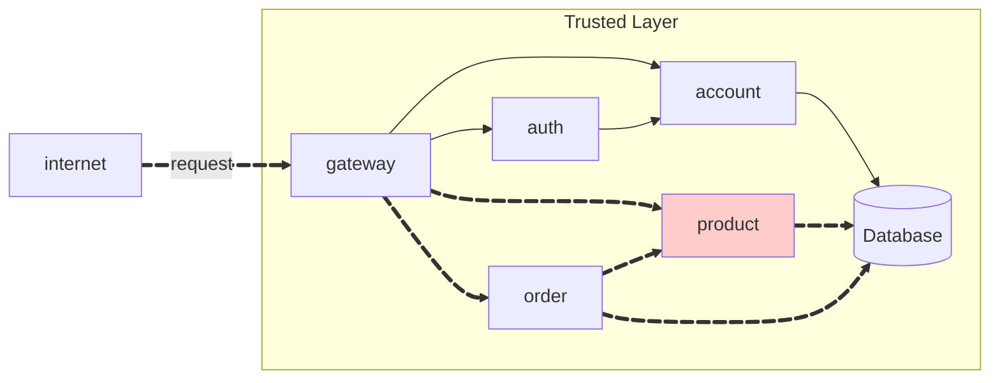

Roteiro API Produto




## Product API

**link product:**
[https://github.com/luisebastos/product](https://github.com/luisebastos/product)

**link product service:**
[https://github.com/luisebastos/product-service](https://github.com/luisebastos/product-service)

The API have the following endpoints:

!!! info "POST /product"

    Create a new product.

    === "Request"

        ``` { .json .copy .select linenums='1' }
        {
            "name": "Chocolate",
            "price": 15.12,
            "unit": "kg"
        }
        ```

    === "Response"

        ``` { .json .copy .select linenums='1' }
        {
            "id": "0f754db7-a051-4007-88c9-a1946e7c767b",
            "name": "Chocolate",
            "price": 15.12,
            "unit": "kg"
        }
        ```
        ```bash
        Response code: 201 (created)
        ```
    
    === "postman"

        {width = 100%}


!!! info "GET /product"

    Get all products.

    === "Response"

        ``` { .json .copy .select linenums='1' }
        [
            {
                "id": "7433b5f6-d5a5-41e5-982e-fe23679396d5",
                "name": "KitKat",
                "price": 1.50,
                "unit": "R$"
            },
            {
                "id": "5fc5479d-b905-4293-82c8-3cf0deb89949",
                "name": "Kinder",
                "price": 1.50,
                "unit": "R$"
            },
            {
                "id": "0f754db7-a051-4007-88c9-a1946e7c767b",
                "name": "Chocolate",
                "price": 15.12,
                "unit": "kg"
            }
        ]
        ```
        ```bash
        Response code: 200 (ok)
        ```

    === "postman"

        {width = 100%}

!!! info "GET /product/{id}"

    Get a product by its ID.

    === "Response"

        ``` { .json .copy .select linenums='1' }
        {
            "id": "7433b5f6-d5a5-41e5-982e-fe23679396d5",
            "name": "KitKat",
            "price": 1.50,
            "unit": "R$"
        }
        ```
        ```bash
        Response code: 200 (ok)
        ```
    
    === "postman"

        {width = 100%}

!!! info "DELETE /product/{id}"

    Delete a product by its ID.
    === "Response"
        ```bash
        Response code: 204 (no content)
        ```

    === "postman"

        {width = 100%}