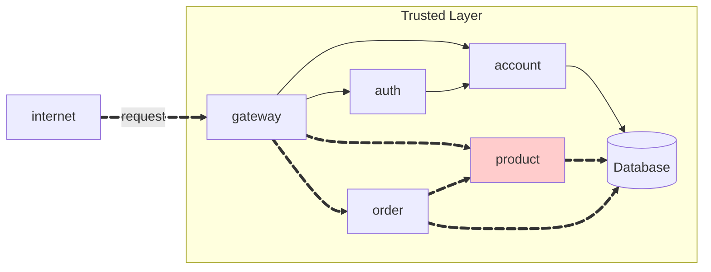
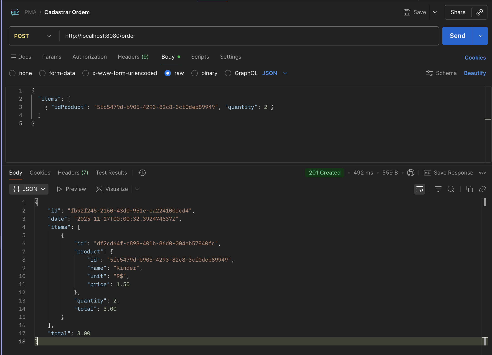

Create a RESTful API resource `ORDER` for a store.




## Order API

**link order:**
[https://github.com/luisebastos/order](https://github.com/luisebastos/order)

**link order service:**
[https://github.com/luisebastos/order-service](https://github.com/luisebastos/order-service)

The API have the following endpoints:

!!! info "POST /order"

    Create a new order **for the current user**.

    === "Request"

        ``` { .json .copy .select linenums='1' }
        {
            "items": [
                { "idProduct": "5fc5479d-b905-4293-82c8-3cf0deb89949", "quantity": 2 }
            ]
        }
        ```

    === "Response"

        ``` { .json .copy .select linenums='1' }
        {
            "id": "fb92f245-2160-43d0-951e-ea224100dcd4",
            "date": "2025-11-17T00:00:32.392474637Z",
            "items": [
                {
                    "id": "df2cd64f-c898-401b-86d0-004eb57840fc",
                    "product": {
                        "id": "5fc5479d-b905-4293-82c8-3cf0deb89949",
                        "name": "Kinder",
                        "unit": "R$",
                        "price": 1.50
                    },
                    "quantity": 2,
                    "total": 3.00
                }
            ],
            "total": 3.00
        }
        ```
        ```bash
        Response code: 201 (created)
        Response code: 400 (bad request), if the product does not exist.
        ```
    === "postman"

        {width = 100%}

!!! info "GET /order"

    Get all orders **for the current user**.

    === "Response"

        ``` { .json .copy .select linenums='1' }
        [
            {
                "id": "fb92f245-2160-43d0-951e-ea224100dcd4",
                "date": "2025-11-17T00:00:32.392475Z",
                "total": 3.00
            },
            {
                "id": "ea222193-d668-459a-84cd-3c1099401a81",
                "date": "2025-11-14T15:24:17.57999Z",
                "total": 3.00
            },
            {
                "id": "72755c10-eb17-4dd0-8aa0-86545200b5c1",
                "date": "2025-11-14T15:01:25.045268Z",
                "total": 3.00
            }
        ]
        ```
        ```bash
        Response code: 200 (ok)
        ```

    === "postman"

        {width = 100%}

!!! info "GET /order/{id}"

    Get the order details by its ID. **The order must belong to the current user.**, otherwise, return a `404`.

    === "Response"

        ``` { .json .copy .select linenums='1' }
        {
            "id": "fb92f245-2160-43d0-951e-ea224100dcd4",
            "date": "2025-11-17T00:00:32.392475Z",
            "items": [
                {
                    "id": "df2cd64f-c898-401b-86d0-004eb57840fc",
                    "product": {
                        "id": "5fc5479d-b905-4293-82c8-3cf0deb89949",
                        "name": "Kinder",
                        "unit": "R$",
                        "price": 1.50
                    },
                    "quantity": 2,
                    "total": 3.00
                }
            ],
            "total": 3.00
        }
        ```
        ```bash
        Response code: 200 (ok)
        Response code: 404 (not found), if the order does not belong to the current user.
        ```
    
    === "postman"

        {width = 100%}