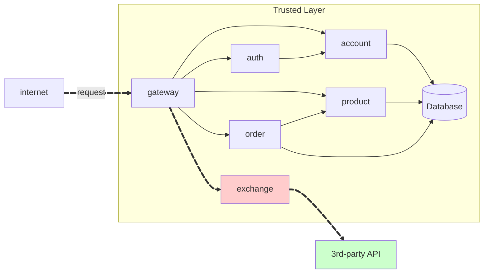
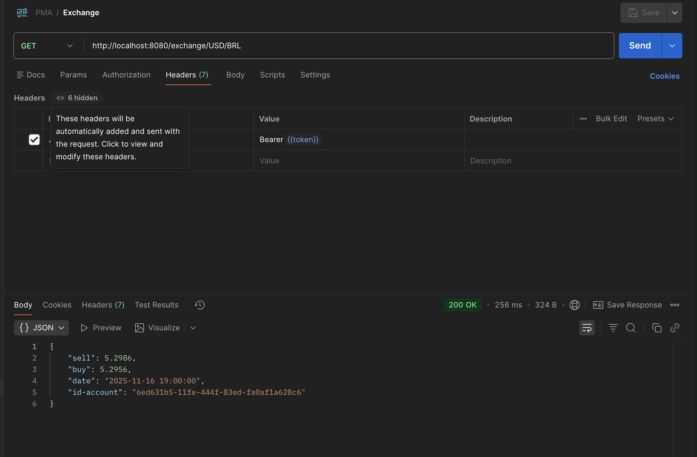

Create a RESTful API resource `Exchange` Using FastAPI[^1] for a store.



## Exchange API

**link exchange:**
[https://github.com/luisebastos/exchange](https://github.com/luisebastos/exchange)


!!! info "GET /exchange/{from}/{to}"

    Get the current of a coin from one currency to another. E.g. `GET /coin/USD/EUR`.

    === "Response"

        ``` { .json .copy .select linenums='1' }
        {
            "sell": 5.2986,
            "buy": 5.2956,
            "date": "2025-11-16 19:00:00",
            "id-account": "6ed631b5-11fe-444f-83ed-fa0af1a628c6"
        }
        ```
        ```bash
        Response code: 200 (ok)
        ```
    
    === "postman"

        {width = 100%}